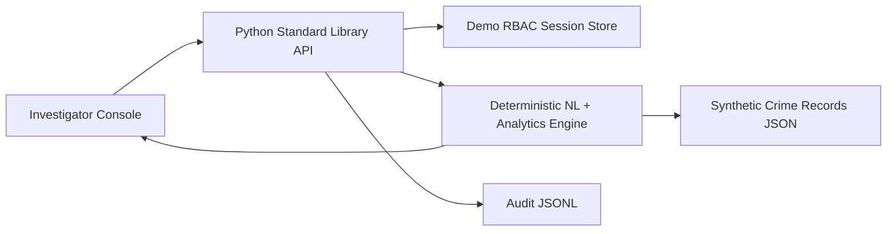
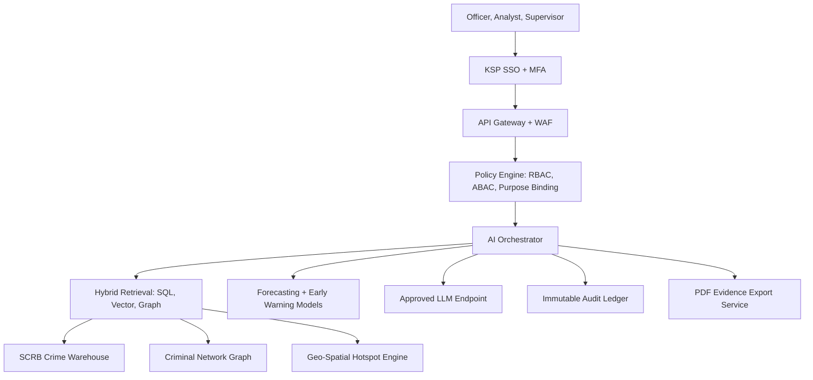

# KSP SCRB Conversational Intelligence Architecture

This repository contains a runnable prototype that demonstrates the product surface, security posture, and analytics workflows for a Karnataka State Police SCRB conversational AI platform. The included dataset is synthetic. A production deployment must connect only to approved SCRB systems and follow KSP data-handling policy.

## Goals

- Natural language querying in English and Kannada.
- Voice-enabled investigation workflow.
- Context-aware follow-up questions over crime records.
- Crime pattern discovery, trend analysis, hotspot scoring, and early warnings.
- AI case linkage across modus operandi, location, time, victim profile, suspect profile, vehicle indicators, and communication indicators.
- Criminal network analysis with role-sensitive identity masking.
- Explainable answers with source cases, filters, model route, and audit IDs.
- PDF-ready conversation export using browser print-to-PDF.
- Role-based access for investigator, analyst, and supervisor personas.

## Runtime Prototype

## Production Target

## Core Components

1. Conversational API
   - Routes every user request through authentication, authorization, query classification, retrieval, response generation, and audit.
   - Keeps conversation state server-side with retention controls.

2. NL Query Planner
   - Detects intent such as hotspot, trend, network, demographic, prediction, or case lookup.
   - Converts the user request into a bounded query plan rather than free-form database access.
   - Supports Kannada through speech-to-text, translation, bilingual entity dictionaries, and native-language responses.

3. Retrieval Layer
   - SQL warehouse for FIR, station, beat, crime type, status, victim, accused, and temporal dimensions.
   - Graph database for suspect, associate, vehicle, phone, address, bank account, and case relationships.
   - Vector index for FIR narrative retrieval, SOPs, past advisories, and legal policy references.

4. Analytics Layer
   - Hotspot scoring: case count, severity, recency, open-case load, repeat modus operandi, and beat density.
   - Network centrality: repeat accused, co-accused links, common assets, station overlap, and community detection.
   - Case linkage: pairwise FIR comparison, confidence scoring, evidence dimensions, connected clusters, and reviewer-ready graph outputs.
   - Forecasting: station and crime-type time series with confidence, drift checks, and analyst review.
   - Demographics: aggregated outreach signals with bias controls and minimum cohort thresholds.

5. Explainability and Audit
   - Each answer returns an audit ID, filters, records considered, source case IDs, model route, and guardrails.
   - Operational recommendations must include rationale and human verification requirements.
   - Audit events should be immutable, searchable, and exportable for internal oversight.

## Data Model Sketch

- `case`: FIR number, date, district, police station, beat, crime type, sections, severity, status.
- `person`: role, demographics, known identifiers, alias records, legal constraints.
- `asset`: vehicle, phone, SIM, device, address, bank account, wallet, social account.
- `event`: arrest, seizure, call, transfer, court milestone, chargesheet, closure.
- `relationship`: person-person, person-case, person-asset, case-case, station-case.
- `geo`: coordinates, beat polygon, station boundary, hotspot cells.

## Safety Rules

- No unrestricted SQL generated directly by the LLM.
- No named-suspect disclosure for aggregate-only roles.
- No predictive policing action without human review, confidence explanation, and bias check.
- No demographic inference for enforcement targeting unless approved by policy and law.
- All exports watermarked and audit-linked.

## Scaling Path

- Package the API as a containerized service behind KSP SSO.
- Replace JSON storage with the SCRB warehouse, graph store, and object storage.
- Add async workers for long-running graph and forecast jobs.
- Add observability: trace IDs, latency, model cost, query volume, failed guardrails, and drift metrics.
- Add red-team evaluation sets in English and Kannada before pilot rollout.
